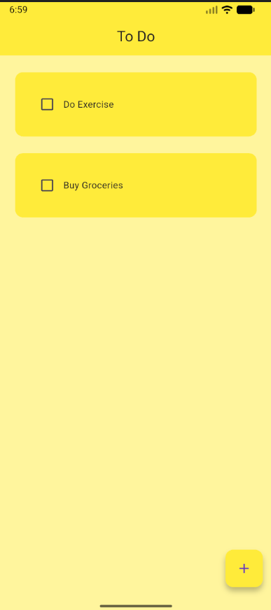
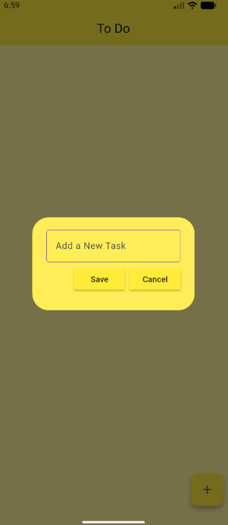
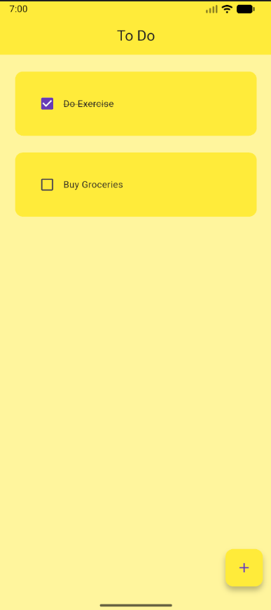
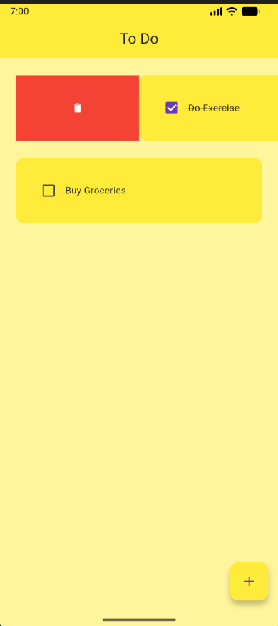

# Flutter To-Do App

A simple to-do application built using Flutter.
This project was built while following a Flutter tutorial and serves as a learning exercise.

## Features
- Add tasks
- Delete tasks
- Mark tasks as completed
- Clean UI using Flutter widgets

## What I Learned
- Stateful widgets
- ListView and dynamic lists
- User interactions and callbacks
- Flutter project structure
- Basic package management

## Screenshots

### Home Page

### Add New Task

### Check Task

### Delete Task

